# Code

# Creating UITests for Xamarin.Forms Apps, Part 1

Hey XamFam!

Today we'll show how to add a few simple UI Tests to a simple Xamarin.Forms app.

## Why UI Tests? 
UI Tests are critical for maintaining our apps. We need to make sure we test every feature, both new and old, before publishing our apps, and the time it takes to test our apps increases exponentially as we add more features.

UI Tests help to automate our testing cycle to help shrink our development cycles and publish our apps more quickly.

Let's get started!

## Hello World UI Test

Let's start with the Hello World app in Xamarin.Forms.

### Step 1. Create File -> New Xamarin.Forms App

Open Visual Studio. I'll be using Visual Studio for Mac.

Select File -> New Solution

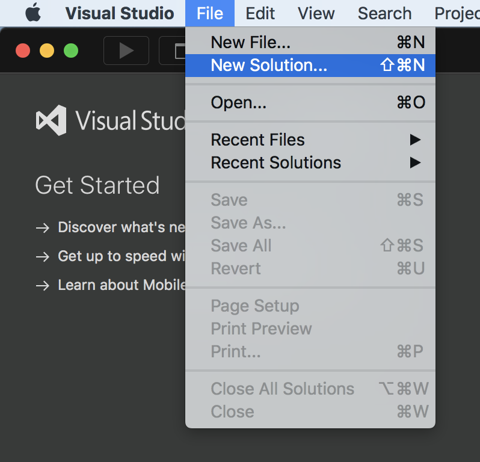

Select Multiplatform -> App -> Blank Xamarin.Forms App -> Next

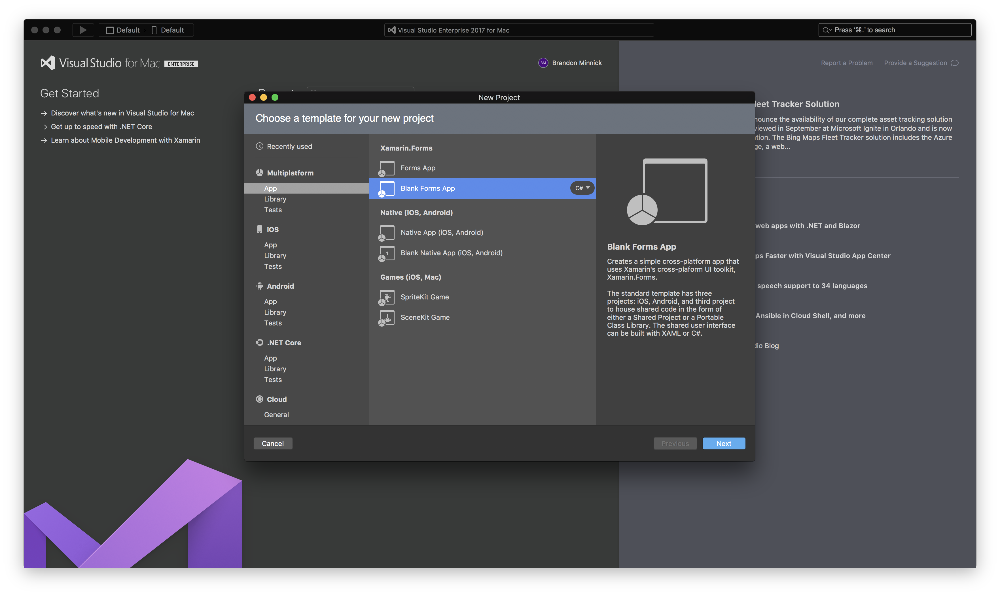

Enter the App Name, then click Next. 

I'm naming mine "HelloWorld"

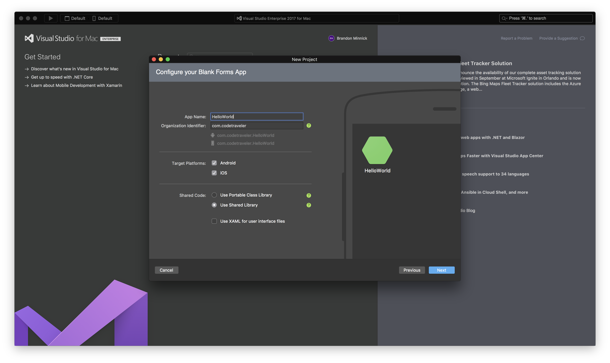

On the next screen, make sure "Add an automated UI test project" is checked, then click "Create"

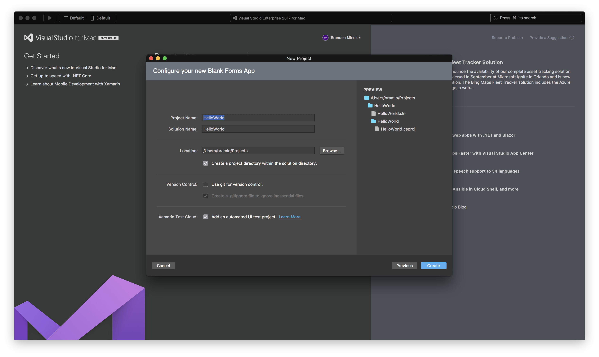

## Setp 2. Update Some NuGet Packages

Update the Xamarin.UITest NuGet Package and the Xamarin.TestCloud.Agent NuGet Package

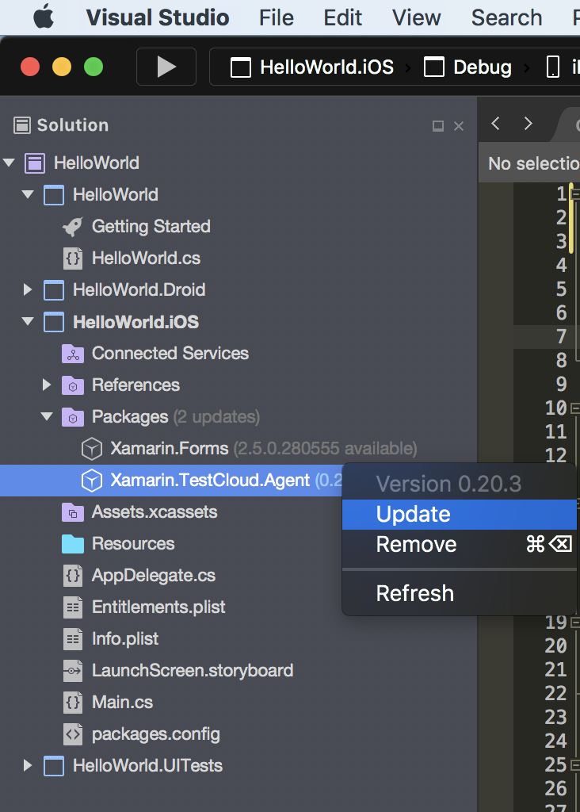
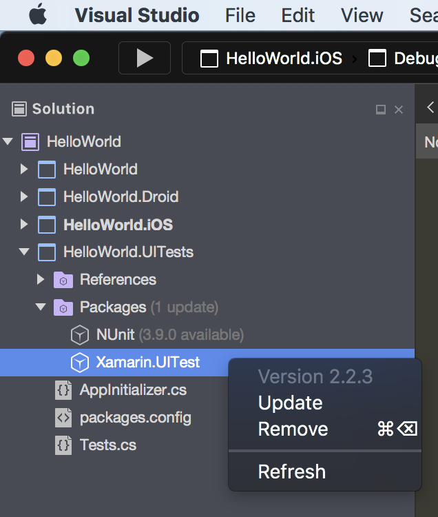

## Step 3. Disable Android Mono Shared Runtime

Xamarin.Android apps require the Mono runtime to be installed every time the our Xamarin.Android app is deployed to a device. To shorten build/deploy times, Visual Studio can install Mono onto the device once in the form of an `.apk` file, and allow future Xamarin.Android apps to leverage the existing Mono "app".

While this is great and can save precious seconds when building/deploying our app during developement, UI Tests aren't compatible with the Shared Mono Rutime, so let's disable it!

Right-click on the Android project and select Options
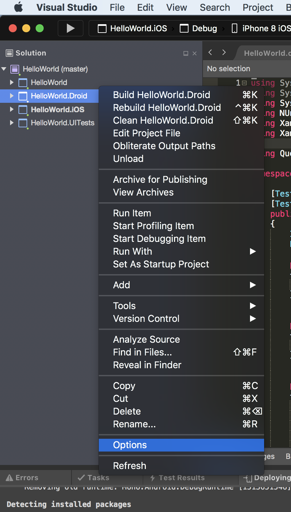

In the Project Options window, select Android Build and uncheck "Use Shred Mono Runtime"

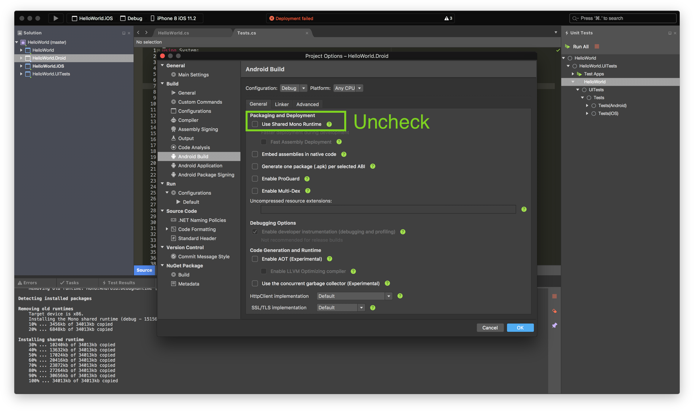


## Step 4. Add Automation.ID to Xamarin.Forms UI

Every `Xamarin.Forms.Element` has a `string` property called [`AutomationId`](https://developer.xamarin.com/api/property/Xamarin.Forms.Element.AutomationId/). This property is completely invisible to the user, and we can leverage it to uniquely identify every UI element that appears on the screen.

Let's assign `AutomationId` for the `Label` in our Hello World Xamarin.Forms app. I named mine `"HelloWorldLabel"`.

```csharp
public class App : Application
{
    public App()
    {
        // The root page of your application
        var content = new ContentPage
        {
            Title = "HelloWorld",
            Content = new StackLayout
            {
                VerticalOptions = LayoutOptions.Center,
                Children = {
                    new Label {
                        HorizontalTextAlignment = TextAlignment.Center,
                        Text = "Welcome to Xamarin Forms!",
                        AutomationId = "HelloWorldLabel"
                    },
                }
            }
        };

        MainPage = new NavigationPage(content);
    }
}
```

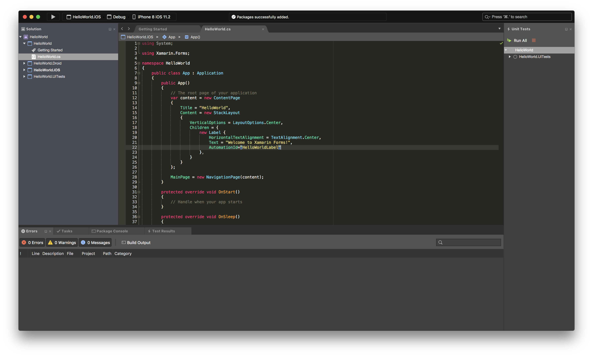

That's it for the app!

Now let's write a UI Test!

## Step 5. Write UI Test

Open `Tests.cs` in the UITest Project. 

Let's first add a `Using` statement to make our lives easier:
```csharp
using Query = System.Func<Xamarin.UITest.Queries.AppQuery, Xamarin.UITest.Queries.AppQuery>;
```

Now let's eidt the existing test, `WelcomeTextIsDisplayed()`:


```csharp
[Test]
public void WelcomeTextIsDisplayed()
{
    // Create a Xamarin.UITest that will search for our Label based on its AutomationId
    Query helloWorldLabelQuery = x => x.Marked("HelloWorldLabel");

    // Perform the Query.
    // `app.Query` will return an Array all UI Elements that use "HelloWorldLabel"
    AppResult[] helloWorldLabelQueryResults = app.Query(helloWorldLabelQuery);

    // Because we've only assigned "HelloWorldLabel" to one UI Element, we are confident that the first result in the 
    string helloWorldLabelText = helloWorldLabelQueryResults?.FirstOrDefault()?.Text;

    // `Assert.AreEqual` tells Xamarin.UITest to compare the expected string, "Welcome to Xamarin Forms!", with the actual string in helloWorldLabelText
    // If the strings are equal, our test will pass.    
    // If the strings are not equal, our test will fail. 
    Assert.AreEqual("Welcome to Xamarin Forms!", helloWorldLabelText);
}
```

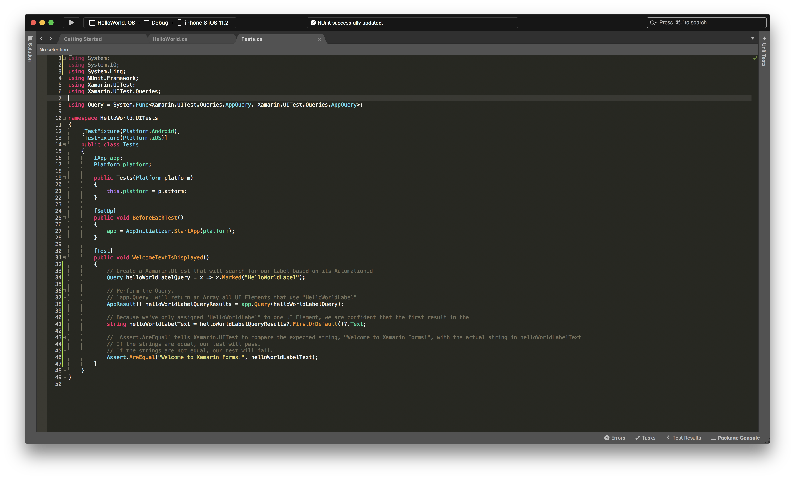

## Step 6. Build the Solution

Select Build -> Build All


## Step 7. Open the Test Results Pad

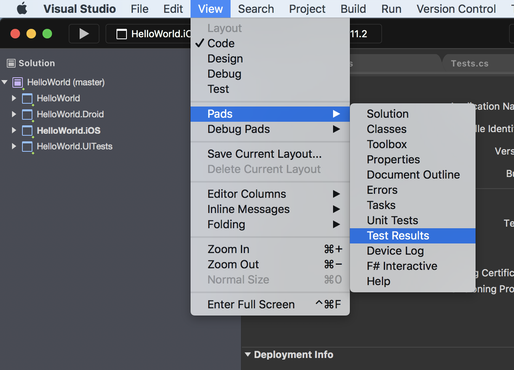

## Step 8. Run the UI Test

Open the Unit Test Pad 
(I know what you're thinking - "We're writing UI Tests! Why are we opening the Unit Tests pad?!". I don't have a good answer. For now, let's just call it an unfortunate name)

View -> Pads -> Unit Tests

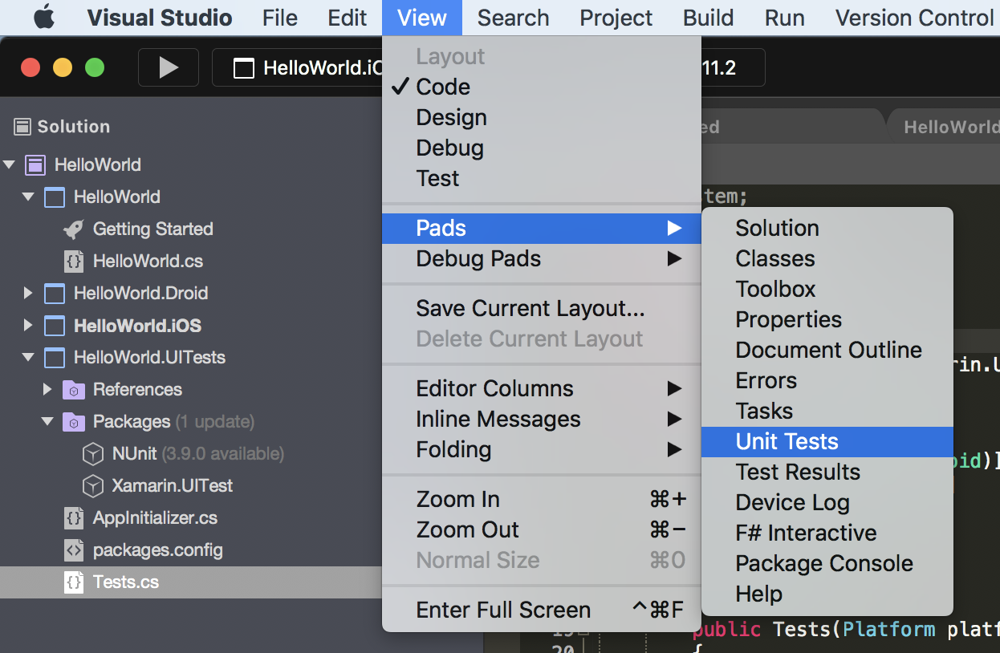

In the Unit Tests Pad (I know...the name...ugghh), right-click on Test Apps, and select Add App Project

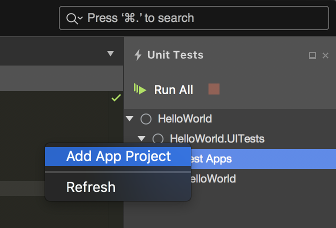

In the Add App Project window, ensure both the iOS and Android projects are selected, then click OK

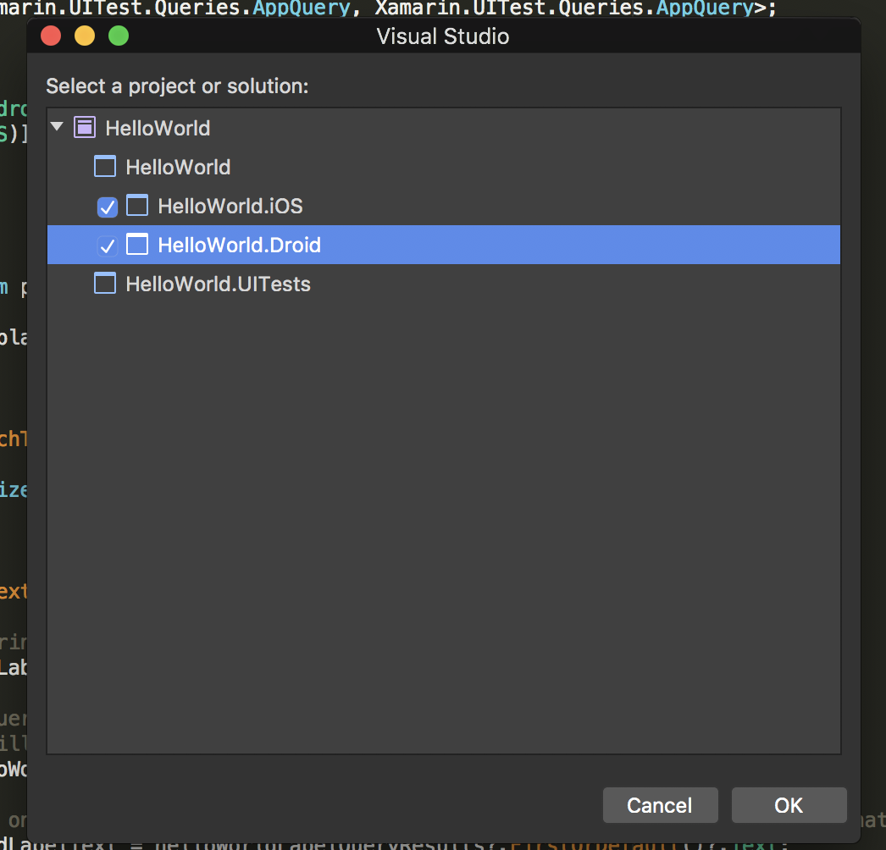

That's it! Now, click Run All!

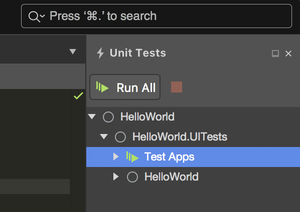


# Traveler
 - Location: Southwest Flight #478 from San Diego to Tampa
 - Destination: Lake Wales, Florida
   - A good friend is getting married, and I'm more than happy to fly accross the country to watch this guy marry his dream girl!
 - Internet Speed ⭐️️️️️️️⭐️️⭐️ 
   - Don't get me wrong, I'm not going to be streaming 4k on this internet connection, but it does everything I need for browsing the web and working on apps
 - Internet Reliability ⭐️️️️️️️⭐️️⭐️⭐️️️️️️️⭐️️
   - I've got to hand it to Southwest: the internet connection has been rock solid; no dropped packets 👊
 - Comfort ⭐️⭐️ 
  - Working on a 15" Macbook Pro on a plane always leaves something to be desired. The leg room is decent on Southwest, but elbow space is at a premium. Sitting on the aisle seat also means I get bumped once every 20 minutes as a person walks down the aisle (see what I did there - it's a wedding pun!). Oh, and the guy in front of me is reclining his seat, so that's fun.
 - Noise ⭐️⭐️
   - No crying babies on this flight, but it's a plane with loud engines. Not even my Bose QC15s + Post Malone can drown out all this background noise.
 - General Ambiance ️⭐️️⭐️
   - It's not my first choice in coding locations, but I like what Southwest is doing with their ambiance. They've installed multi-colored lights in their 737s which give off different hues. Right now the cabin is illuminated in soft blue + red light, and I kind of dig it.
 - Overall Score: ️⭐️️️⭐️️⭐️️ 


# For App Center Test Write-up

As mobile app developers, we need to be confident that our app works on every available device _before_ we push our app to the app stores. 

I learned this the hard way: I deployed my app, Punday, to the iOS, Android and Windows app stores after testing it on a handful of devices. Good enough, right? That's what I thought. A few weeks later, I get a 1-Star review that says "App doesn't work, always crashes on Android 4.2.2". 

"No, way", I thought, "I tested it on Android 4.2.2!" 

Turns out, Samsung tweaked how the Galaxy A3 parses the Android Manifest. Even though I had tested my app on a Android device, I failed to test it specifically on a Samsung Galaxy A3 running Android 4.2.2. 

This is the crazy world we live in as mobile app developers: we need to test our app on every device

### Android
Android allows device manufactures (e.g. Samsung) and carriers (e.g. Sprint) to tweak the operating system. 